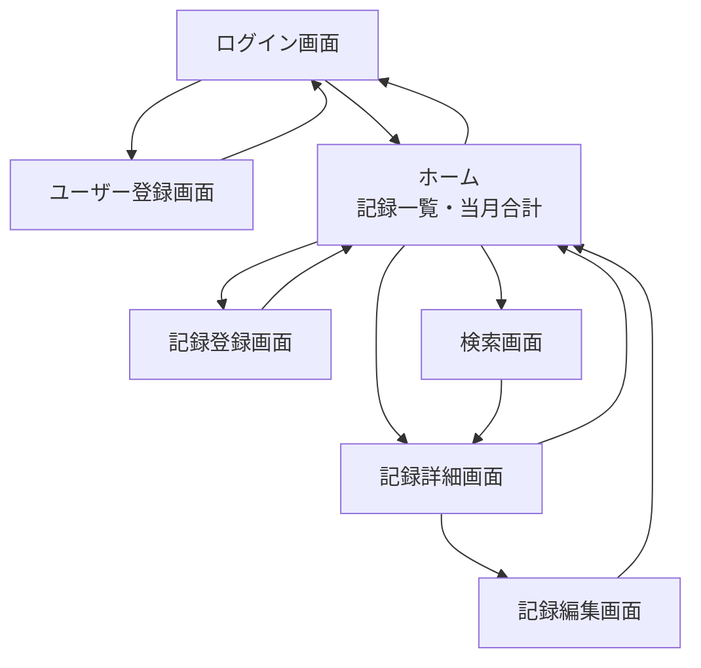
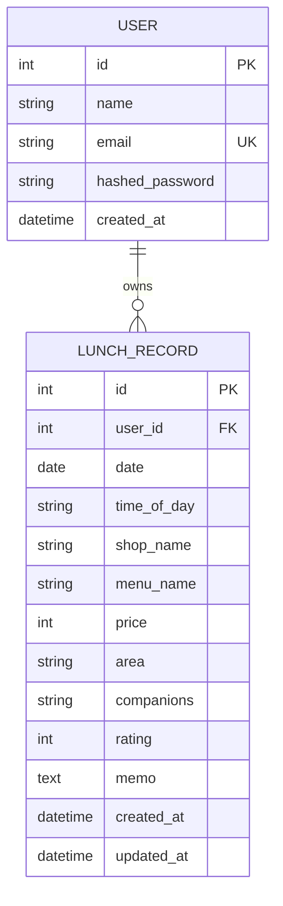

# ランチ記録アプリ 基本設計

**バージョン:** 2.0
**作成日:** 2026年3月25日
**更新日:** 2026年3月26日
**対象フェーズ:** Phase 1（MVP）+ Phase 2（ユーザー認証）

---

## 1. システム構成

```
フロントエンド（HTML/CSS/JavaScript）
　　↓ HTTP（Bearer Token）
バックエンド（Python FastAPI）
　　├── 認証モジュール（JWT / bcrypt）
　　↓
データベース（SQLite ローカル / PostgreSQL 本番）
```

シンプルなSPA構成。認証はJWTトークンをlocalStorageで管理し、APIリクエスト時にAuthorizationヘッダーに付与する。

---

## 2. 画面遷移図



未ログイン状態でホーム・記録・検索画面にアクセスした場合はログイン画面へリダイレクトする。

---

## 3. データベース設計



---

## 4. API設計

**認証（/auth）**

| メソッド | パス | 概要 | 認証要否 |
|---------|------|-----|---------|
| POST | /auth/register | ユーザー登録 | 不要 |
| POST | /auth/login | ログイン（トークン発行） | 不要 |
| GET | /auth/me | ログインユーザー情報取得 | 必要 |

**記録（/api/records）**

| メソッド | パス | 概要 | 認証要否 |
|---------|------|-----|---------|
| GET | /api/records | 記録一覧取得（自分のみ） | 必要 |
| POST | /api/records | 記録登録 | 必要 |
| GET | /api/records/{id} | 記録詳細取得 | 必要 |
| PUT | /api/records/{id} | 記録更新 | 必要 |
| DELETE | /api/records/{id} | 記録削除 | 必要 |
| GET | /api/records/search | キーワード・エリア検索 | 必要 |

**集計（/api/summary）**

| メソッド | パス | 概要 | 認証要否 |
|---------|------|-----|---------|
| GET | /api/summary/monthly | 当月合計金額取得 | 必要 |

---

## 5. 画面設計（概要）

### 5.1 ログイン画面（Phase 2）
- メールアドレス・パスワードの入力フォーム
- ログインボタン押下でJWT取得・ホームへ遷移
- 新規登録画面へのリンク

### 5.2 ユーザー登録画面（Phase 2）
- 名前・メールアドレス・パスワードの入力フォーム
- 登録成功後は自動ログインしてホームへ遷移

### 5.3 ホーム
- 当月合計金額をヘッダーに表示
- 記録を日付新しい順にカード形式で一覧表示（ログインユーザーのもののみ）
- 右下に記録登録ボタン（FAB）
- 上部に検索ボタン・ログアウトボタン

### 5.4 記録登録画面
- 各項目の入力フォーム
- 日付はデフォルトで今日
- 保存ボタンでホームに戻る

### 5.5 記録詳細画面
- 全項目を表示
- 編集・削除ボタン

### 5.6 検索画面
- キーワード入力欄
- エリア選択（プルダウン）
- 結果一覧表示

---

## 6. 技術スタック

| レイヤー | 技術 |
|---------|-----|
| フロントエンド | HTML / CSS / JavaScript |
| バックエンド | Python（FastAPI） |
| 認証 | JWT（python-jose）＋ bcrypt 4.x（passlib経由） |
| データベース | SQLite（ローカル）/ PostgreSQL（Railway本番） |
| ホスティング | Railway |
| 開発支援 | Claude Code |

---

*内容は一式通しを優先したざっくり版。詳細設計は Claude Code での製造前に補完する。*
